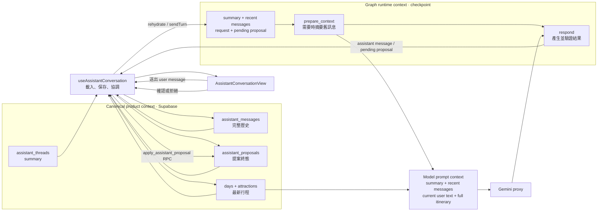

# 前端 LangGraph 維護指南

## 架構邊界

旅程助理的 LangGraph 完全在瀏覽器執行。主要程式分工如下：

- `src/features/assistant/assistantGraph.ts`：graph、operation 驗證、前置摘要策略與真實節點進度事件。
- `src/features/assistant/assistantApi.ts`：Gemini proxy adapter、function calling、Zod runtime 驗證及模型估算的交通時間。
- `src/features/assistant/assistantSchemas.ts`：一般回答、行程編輯工具、operation 與摘要的 Zod schema。
- `src/features/assistant/assistantPlaceEnrichment.ts`：提案套用成功後才執行的 Google 地點 best-effort enrichment。
- `src/features/assistant/AssistantSection.tsx`：組合 conversation controller、聊天室 view 與全頁 toolbar。
- `src/features/assistant/useAssistantConversation.ts`：thread/message/proposal 載入、canonical persistence、graph 執行與恢復、提案決策。
- `src/features/assistant/AssistantConversationView.tsx`：對話列表、訊息、提案卡與 composer；不直接存取 repository 或 graph。
- `src/features/assistant/types.ts`：UI、repository 與 graph 共用的公開型別。
- `src/lib/assistantCheckpointer.ts`：以 Supabase Data API 實作 LangGraph `BaseCheckpointSaver`。
- `supabase/functions/gemini-proxy`：只代理已驗證使用者對固定 Gemini model 的 `generateContent`，不執行 graph，也不讀寫資料庫。
- `supabase/migrations/20260812130326_add_travel_assistant.sql`：聊天資料、checkpoint、RLS、checkpoint CAS 與 proposal 原子套用。

LangGraph state 是「可恢復的執行狀態」，不是產品資料的唯一來源。完整聊天歷史與 proposal 分別以 `assistant_messages`、`assistant_proposals` 為準；實際行程仍以 `days`、`attractions` 為準。不要只寫 checkpoint 而略過 canonical tables，也不要從 checkpoint 直接覆寫行程。

建立 runtime 的基本方式是：

```ts
const checkpointer = new SupabaseAssistantCheckpointer(supabase)
const runner = createAssistantGraph(checkpointer, {
  model: browserAssistantModel,
  proposals,
})
```

Graph 注入的 `proposals` 只負責以 `savePending` 冪等保存提案。確認或拒絕不再 resume graph，而由 `useAssistantConversation` 直接呼叫 `apply_assistant_proposal(p_proposal_id, p_approved)`；RPC 會檢查擁有者與 day revision，避免前端繞過驗證或跨裝置覆蓋。

## Context 如何運作

這裡的 context 指「模型在一個 turn 能看到的上下文」，不是 React Context。助理目前沒有建立 React Provider；畫面只有一個 feature 子樹，以 `useAssistantConversation` 回傳明確的 state/actions 給純 UI，比額外的全域 Provider 更直接。

Context 分成三層，不可互相取代：

| 層級 | 內容 | 來源與壽命 |
| --- | --- | --- |
| Canonical product context | 完整 messages、proposal 狀態、thread summary、最新 itinerary | Supabase tables/RPC；跨裝置的產品事實來源。 |
| Graph runtime context | `AssistantGraphState` 的 `summary`、近期 `messages`、本次 `request` 與 pending proposal | LangGraph checkpoint；只為恢復執行，不保證含完整聊天歷史。 |
| Model prompt context | 舊摘要、近期對話、本次 user text、完整最新 itinerary | 每次 `respond` 即時組合；呼叫 Gemini 後即結束。`dayRevisions` 留在 runtime control context，不送給模型。 |

資料流如下：



一次一般 turn 的 context 組合規則：

1. `useAssistantConversation` 先把 user message 寫入 `assistant_messages`，再呼叫 `runner.sendTurn`；因此即使模型失敗，使用者輸入仍可安全重試。
2. 有相容 checkpoint 時，runner 使用其中的 `summary` 與近期 `messages`；沒有 checkpoint 或版本不相容時，以 thread summary 與 canonical messages 重建。
3. `prepare_context` 只檢查「本次 turn 以前」的 messages。超過門檻才把舊內容併入 `summary`，並保留最近訊息；本次 user message 絕不被摘要掉。
4. `respond` 把整理後的 summary/recent messages，加上 `request.text` 與完整最新 itinerary 組成模型 prompt。完整 itinerary 每次都重送，避免舊摘要覆蓋目前行程。`request.dayRevisions` 不送給模型，只在建立 proposal 時複製到 `expectedDayRevisions`，供套用 RPC 做 optimistic concurrency control。
5. 模型結果先經 Zod 與 itinerary invariant 驗證，再保存 assistant message 或 pending proposal。Checkpoint 可以刪除重建；canonical tables 不可由 checkpoint 回寫覆蓋。

偏好或限制若重複出現，以較新的訊息為準；行程資料永遠以本次 request 的完整 itinerary 為準。摘要只保留決策、偏好、限制、日期與未解問題，不保存唯一一份 proposal 結構。

## Graph state 與流程

`AssistantGraphState` 位於 `src/features/assistant/types.ts`：

| 欄位 | 用途 |
| --- | --- |
| `graphVersion` | checkpoint 相容性版本；目前為 `ASSISTANT_GRAPH_VERSION = 4`。 |
| `summary` | 已壓縮的舊對話脈絡。 |
| `messages` | graph 目前保留的近期 user/assistant 訊息，不一定是完整聊天歷史。 |
| `request` | 當次尚待 `respond` 處理的 `AssistantTurnRequest`；完成後清為 `null`。 |
| `assistantMessage` | 最近一次模型產生的訊息，方便 UI 取得當次輸出。 |
| `pendingProposal` | `respond` 到 `persist_proposal` 之間的暫存；保存 canonical proposal 後清為 `null`。 |

節點與 edge：

```text
START -> prepare_context -> respond
  ├─ 無 proposal -> finish_turn -> END
  └─ 有 proposal -> persist_proposal -> finish_turn -> END
```

### Node、context 與 state 對照

正式 UI 注入的是 `assistantApi.ts` 的 `browserAssistantModel`。`START`、`END` 是 LangGraph sentinel，不是自訂 node，因此沒有 prompt 或 state update。

| Node | 讀取的 context | Prompt template | 產出與影響的 state | 外部副作用／下一步 |
| --- | --- | --- | --- | --- |
| `prepare_context` | `request.threadId`、`request.turnId`、`summary`、`messages` | 未達摘要門檻時沒有 prompt；達門檻時使用下方「摘要 prompt」 | 未達門檻回傳 `{}`；達門檻更新 `summary`，並把 `messages` 壓成「最近 `recentMessageCount` 則舊訊息 + 本次 turn 訊息」 | 呼叫 `model.summarize`；固定前往 `respond` |
| `respond` | `summary`、`messages`、`request.text`、`request.itinerary`、`request.dayRevisions`、turn/thread/itinerary ID | 使用下方「回覆 prompt」，強制呼叫一個 tool | 建立 `assistantMessage` 並 append 到 `messages`；有提案時建立 `pendingProposal`，否則為 `null` | 解析 tool output，normalize 並驗證 operations；有提案前往 `persist_proposal`，否則前往 `finish_turn` |
| `persist_proposal` | `pendingProposal` | 無 prompt | 保存後把 `pendingProposal` 清為 `null` | `proposals.savePending` 冪等寫入 canonical proposal；前往 `finish_turn` |
| `finish_turn` | `request.threadId`，僅用來回報進度 | 無 prompt | `request = null` | 保存完成 checkpoint，前往 `END` |

`respond` 的 context 有兩種用途：

- 模型可見：`summary`、最多最後 10 則 `messages`、`request.text`、序列化後的完整 itinerary。
- 僅 graph 可見：`request.dayRevisions` 與各種 ID。模型產出 proposal 後，graph 才把這些可信值寫入 `threadId`、`turnId`、`itineraryId`、`expectedDayRevisions`；模型不能自行指定。

#### 摘要 prompt template（`prepare_context`）

只有先前訊息達到 30 則或 24,000 字元時才呼叫；本次 turn 會先被排除。`runner.summarizeThread` 不是 graph node，但會以目前 checkpoint 的 `summary` 和 `messages` 使用同一份 template。

```text
請以使用者語言（{{ui_language}}）整理旅遊規劃對話，保留使用者偏好、已決定事項、未解問題；不要包含待確認的行程修改。
只回傳 {"summary":"..."}。

{{#if current_summary}}
既有摘要：{{current_summary}}
{{/if}}

新增對話：{{JSON.stringify(messages.map(({ role, content }) => ({ role, content })))}}
```

輸出必須通過 `assistantSummarySchema`：

```json
{ "summary": "整理後的文字" }
```

成功後只影響 `summary` 與近期 `messages`；不修改 canonical `assistant_messages`、`pendingProposal` 或 itinerary。

#### 回覆 prompt template（`respond`）

`buildAssistantPrompt` 以空行連接下列區塊；空的摘要或近期對話區塊會省略。以下保留正式 template 的規則與動態插槽：

```text
你是旅遊行程助理。依序以目前完整行程、較新的對話、摘要為準；回答須延續城市、日期、步調與偏好，推薦要避開重複景點並利用順路空檔。

預設使用者需要你協助釐清需求與做決定。只要目標和限制足夠，就主動給出一個具體安排與簡短理由；非關鍵細節採合理預設，不要反覆把規劃工作丟回使用者。

依語意與上下文判斷意圖，不依賴特定關鍵字。純詢問只回答；若使用者接受、選擇或要求執行前文建議（包括「好」、「就這樣」、「都要」、「幫我決定」等省略語），資訊足夠就呼叫 propose_itinerary_edit，不要要求重述。只有多種合理解讀會明顯改變結果時，才用 answer_travel_question 問一個必要問題。

修改只限現有日期的開始時間與景點，且只動要求的部分；不可改旅程日期、幣別、費用或待辦。既有 dayId/attractionId 必須原樣使用；新增景點不給 id；reorder_attractions 可只列移動項目；update_attraction.changes 只放變動欄位。

使用使用者語言（{{language_from_current_turn}}），景點也不轉成英文羅馬拼音。新增景點只給 name、duration、transportMode、travelTime 與必要的 locationName；不要給 description、cost、Place ID、座標或地址。

新增或重排景點時，主動為每一段安排 transportMode 與 travelTime；預設採一般觀光客容易使用的步行或公共運輸，僅在明顯不適合時選計程車或其他方式。提案須依 day.startTime、每段交通時間與 duration 順推可執行時間，並考慮相鄰距離與一般營業／遊玩時段；不得重疊、跨日或過晚。沒有即時路線資料時做保守的整數分鐘估算，不必為此追問；無法合理估算才填 null，且不得宣稱已查證。

只呼叫一個工具且不要在工具外回答：一般回答／必要澄清用 answer_travel_question；可執行修改用 propose_itinerary_edit，提供簡短 reply 與 operations，title/explanation 可省略。

{{#if summary}}
先前摘要：{{summary}}
{{/if}}

{{#if recent_history}}
近期對話：
{{role}}: {{content}}
...
{{/if}}

目前完整行程（最新現況，包含所有日期與景點順序）：{{itinerary_json}}

使用者：{{current_user_text}}
```

近期對話先取 `state.messages` 最後 10 則；若最後一則正好是本次 user message，template 會移除它，避免和最後的 `使用者：{{current_user_text}}` 重複。`itinerary_json` 只包含模型排程需要的欄位：trip title/date range，以及每一天的 ID、日期、開始時間和各景點的順序、ID、名稱、地點、時間、duration、transport mode、travel time。

模型被設定為 `temperature: 0.2` 並強制只能呼叫一個工具：

| Tool output | Schema | Graph 轉換 |
| --- | --- | --- |
| `answer_travel_question` | `{ "reply": string }` | 建立 assistant message；`pendingProposal = null` |
| `propose_itinerary_edit` | `{ "reply": string, "title"?: string, "explanation"?: string, "operations": AssistantOperation[] }` | schema 補預設 title/explanation；graph normalize/validate operations，補可信 ID、revision、status 與 timestamps，再建立 pending proposal |

若模型版本忽略 function calling 而回傳文字，系統只接受能通過相同 Zod schema 的 JSON fallback；未驗證的文字或未知 operation 不會進入 state。

Graph progress callback 只回報實際節點：檢查前文、摘要前文、模型生成、驗證、保存提案與 checkpoint；proposal 套用進度由 UI controller 在呼叫 RPC 時另外更新，不用 timer 模擬。

所有 graph invoke 都使用 `durability: 'exit'`，每個 turn 完成時只保存一次 runtime snapshot。不要改回預設的逐 super-step 寫入，否則會增加 checkpoint 與 Data API 往返。

### 一般 turn

1. UI/repository 先以 client-generated `threadId`、`turnId` 保存 user message。
2. 呼叫 `runner.sendTurn(request)`。
3. runner 載入最新 state、檢查 `graphVersion`，將 user message 與 request 送入 graph。
4. `prepare_context` 視需要先壓縮舊訊息，`respond` 再處理本次訊息，最後到達 `END`。
5. `sendTurn` 回傳完成的 `AssistantGraphState`；呼叫端冪等保存 assistant message。

同一個 thread 不可同時送兩個 turn。`assistant_put_checkpoint` 的 CAS 會拒絕落後的分支；收到「另一個裝置已變更」時應重新讀取 thread/messages/state，不能盲目重送舊 state。

### Proposal 保存與決策

1. `respond` 依本次語意與近期對話判斷修改意圖；不要求特定關鍵字，承接前文的簡短確認也可建立 proposal。
2. `normalizeAssistantOperations` 先把模型只列出部分景點的 reorder 補成完整順序（未提及的景點維持原順序），再由 `validateAssistantOperations` 驗證 day/attraction ID 與重複/未知 ID；新增景點可以沒有 Google 位置資料，禁止虛構座標即可。
3. `persist_proposal` 保存 canonical proposal。
4. graph 正常結束；UI 從 canonical proposal 顯示 diff 與確認按鈕。
5. UI 以 proposal ID 呼叫冪等 `apply_assistant_proposal` RPC。核准時 RPC 驗證 owner 與 day revision，衝突回傳 `expired`；拒絕直接寫入 `rejected`，兩者都不觸發模型。
6. RPC 回傳 `applied` 後，UI 才 best-effort 補齊 Google 地點資料；失敗不回滾行程。

Graph 永遠不直接修改 itinerary。提案生成、canonical 保存、使用者決策是三個清楚且可獨立重試的步驟。

### 手動整理

`runner.summarizeThread(threadId)`：

1. 讀取最新 checkpoint 並檢查 graph version。
2. 以目前 `summary` 與 state 中的 `messages` 呼叫 `model.summarize`。
3. 透過 `workflow.updateState` 建立新 checkpoint，保存新摘要與最後 `recentMessageCount` 則訊息。

預設自動摘要門檻是 30 則 state 訊息或 24,000 字元，整理後保留最近 10 則。可用 `AssistantGraphDependencies` 覆寫門檻。摘要不刪除 `assistant_messages` 原文，也不可把 pending proposal 的結構化內容只存在摘要中。

## Supabase checkpointer

`SupabaseAssistantCheckpointer` 繼承 `BaseCheckpointSaver`，實作：

- `getTuple(config)`：取得指定 checkpoint，未指定 ID 時取 thread/namespace 最新一筆，並載入 pending writes。
- `list(config, options)`：依 checkpoint ID 由新到舊列出，支援 namespace、`before`、metadata filter 與 limit。
- `put(config, checkpoint, metadata, newVersions)`：序列化後呼叫 `assistant_put_checkpoint` RPC。
- `putWrites(config, writes, taskId)`：以複合主鍵 upsert intermediate/pending writes。
- `deleteThread(threadId)`：刪除該 thread writes 與 checkpoints；刪除產品 thread 時資料庫 FK 也會 cascade。

預設資料表可透過 constructor options 覆寫，但正式環境使用：

- `assistant_graph_checkpoints`，主鍵 `(thread_id, checkpoint_ns, checkpoint_id)`；保存 parent ID、typed checkpoint、typed metadata、可選 turn ID。
- `assistant_graph_writes`，主鍵 `(thread_id, checkpoint_ns, checkpoint_id, task_id, idx)`；保存 channel 與 typed value。
- `assistant_threads.latest_checkpoint_id` 是 thread 最新指標。

所有表均啟用 owner-only RLS。瀏覽器只使用登入者 access token 與 publishable key；不可使用 Postgres connection string 或 service role。

### Typed serializer

Saver 使用 LangGraph 提供的 `this.serde.dumpsTyped/loadsTyped`，而不是直接 `JSON.stringify`。序列化結果拆成 type 與 bytes，bytes 再轉 base64 text 存入 Data API。這能正確處理 `Uint8Array` 與 LangChain message 等 typed value。

若變更 schema，`checkpoint_type/checkpoint_payload`、`metadata_type/metadata_payload`、`value_type/value_payload` 必須成對保留。不要只存 JSONB，否則恢復 pending writes 或特殊型別時可能失真。

### CAS 與冪等性

正式 UI 的 `put` 會保存完整 snapshot，並呼叫：

```text
assistant_replace_checkpoint(...)
```

RPC 以 try advisory lock 與 expected latest 做 CAS，插入新 snapshot 後在同一 transaction 刪除該 thread/namespace 的舊 checkpoint 與 writes。因此每個對話 namespace 只保留最新一份可恢復狀態，不會隨 turn 累積 parent chain；完整聊天仍保存在 `assistant_messages`。

舊版 delta chain 的讀取會為每個 parent 各查 checkpoint 與 writes，形成 N+1。正常新 turn 會先以 `discardLegacyHistory` 只讀最新兩筆；發現多筆或 parent chain 時直接刪除 runtime，並以 canonical messages/thread summary 重建。所有 checkpoint Data API/RPC request 均有 12 秒 abort timeout。

checkpointer conformance 測試使用 `{ compactHistory: false }`，此模式的 `put` 呼叫：

```text
assistant_put_checkpoint(
  p_thread_id,
  p_checkpoint_ns,
  p_checkpoint_id,
  p_parent_checkpoint_id,
  p_checkpoint_type,
  p_checkpoint_payload,
  p_metadata_type,
  p_metadata_payload,
  p_turn_id,
  p_expected_latest_checkpoint_id
)
```

`p_expected_latest_checkpoint_id` 通常使用本次 checkpoint 的 parent ID；建立無 parent 的新 lineage 時，saver 會先讀取該 namespace 的最新 ID 作為 expected value。RPC 以 `(thread_id, checkpoint_ns)` advisory lock 串行化，確認 namespace 最新 checkpoint 仍符合 expected，才插入並更新 root thread 最新指標；不一致以 SQLSTATE `40001` 拒絕，代表另一個 tab/裝置已前進。

若 RPC 已提交但 HTTP 回應遺失，重送會遇到 CAS 失敗。Saver 會讀取相同 checkpoint ID，只有 type、payload、metadata 與 parent 全部相同才視為成功；不同內容仍拋出原錯誤。不要把所有 `40001` 都吞掉。

## Graph version 與重建

每次改變 state shape、node/edge 的恢復語意或 checkpoint serializer contract 時：

1. 增加 `ASSISTANT_GRAPH_VERSION`。
2. 新建 thread 時同步寫入 `assistant_threads.graph_version`。
3. 保留完整 canonical messages/proposals，讓 UI/repository 可從它們重建 state。
4. 捕捉 `AssistantGraphVersionError`；不要用新 graph 直接 resume 舊 checkpoint。
5. 新 turn 以 `assistant_threads.summary` 與 canonical `assistant_messages` 重建新 checkpoint；既有 proposal 仍以 canonical table 為準，不重跑模型。

只改 prompt 文案或 UI 通常不必升版。若無法判斷舊 checkpoint 的 `next` 是否仍能正確落到同一 node，就應升版。

## 擴充方式

### 新增 operation

新增 itinerary 修改能力時必須同步完成：

1. 在 `AssistantOperation` union 加入精確型別。
2. 在 `assistantSchemas.ts` 的 Zod discriminated union 做 runtime allowlist、型別與範圍驗證；未知欄位不可靜默接受。
3. 在 `validateAssistantOperations` 驗證所有引用 ID 與跨欄位 invariant。
4. 更新 Gemini prompt 的 allowed operation 清單及 structured response contract。
5. 在 proposal materializer 將 operation 轉成 before/after snapshots；真正套用仍由 `apply_assistant_proposal` 驗證並原子執行。
6. 補 parser、validator、snapshot、RPC 與 UI diff 測試。

不得讓模型直接指定 owner、revision、資料表名稱或任意 SQL 欄位。新增景點的座標與 Place ID 不應只靠 prompt 信任；Places 查不到時可以保留空值，之後由使用者手動補上。交通時間由模型估算，但必須是非負整數分鐘；無法合理估算時使用 `null`。

### 新增 node

- 先判斷它是否真的需要獨立恢復邊界；每個 node 都可能影響 checkpoint 與 replay。
- 外部 API/DB 副作用必須冪等，並放在獨立 node；行程套用仍由 UI controller 呼叫 canonical RPC。
- 更新所有 conditional edge 的完整 routing map，避免未宣告分支。
- 若 node 改變舊 checkpoint 的 `next` 語意，增加 graph version。
- 保持 `durability: 'exit'`，除非需求明確需要更細的恢復點並已有容量評估。

## 測試與故障排查

主要 graph 測試在 `src/features/assistant/assistantGraph.test.ts`。最低驗證：

```sh
npm test -- --run src/features/assistant/assistantGraph.test.ts
npx tsc -p tsconfig.app.json --noEmit
npm run build
```

checkpointer 變更還應以 Supabase local/preview 環境測試 RLS、RPC CAS、pending writes round-trip、刪除 cascade，並跑 LangGraph checkpointer conformance tests。涉及恢復語意時一定要測真實瀏覽器重新整理及另一個裝置恢復，單靠 Node 測試不足。

常見問題：

| 症狀 | 原因與處理 |
| --- | --- |
| `AssistantGraphVersionError` | 本地程式與 checkpoint 版本不同；從 canonical messages/proposal 重建，不要直接 resume。 |
| `Assistant turn request is missing` | 舊 checkpoint 的 request 狀態不完整；UI 會刪除該 runtime checkpoint，依 canonical messages 與本次 request 重建後重試。 |
| `Assistant thread changed on another device` / `40001` | CAS 偵測到同 thread 已前進；重新載入 thread/state，禁止覆蓋或無限自動重試。 |
| Proposal 沒有出現在 UI | 確認 `persist_proposal` 已用正確的 thread/turn ID 寫入 canonical proposal，並重新載入 proposal list。 |
| 核准後重複套用 | UI 未以 proposal ID 使用原子、冪等 RPC；應呼叫 `apply_assistant_proposal`。 |
| 套用後確認按鈕再次出現 | canonical proposal 被 replay 的 `savePending` 重設為 pending，或舊的列表請求覆蓋新狀態。保存 proposal 必須使用 `ignoreDuplicates`，UI 以 load sequence 排除過期回應，並在確認後固定顯示 RPC 的 `applied`/`expired` 終態。 |
| 核准後變成 expired | 目標 day revision 已改變；這是預期的衝突保護，重新產生 proposal。 |
| Checkpoint 無法反序列化 | type/payload 配對被改壞、base64 被截斷，或 graph version 未升；不可嘗試用純 JSON 強行恢復。 |
| 摘要後舊訊息在聊天室消失 | UI 錯把 graph `messages` 當完整歷史；聊天室應查 `assistant_messages`，state 只保留模型近期上下文。 |
| 新增景點沒有位置資料 | proposal 階段刻意不查 Google；套用成功後才 best-effort 補齊。查不到時 `placeId`、座標維持 `null`，但模型估算的 `travelTime` 可保留。 |
| 排程沒有交通時間 | 模型無法從行程脈絡合理估算；`travelTime` 可保持 `null`，不會阻擋提案。 |
| PWA 更新後舊分頁行為不同 | 舊 bundle 仍在執行；以 graph version 阻止不相容 resume，提示重新載入並重建。 |
