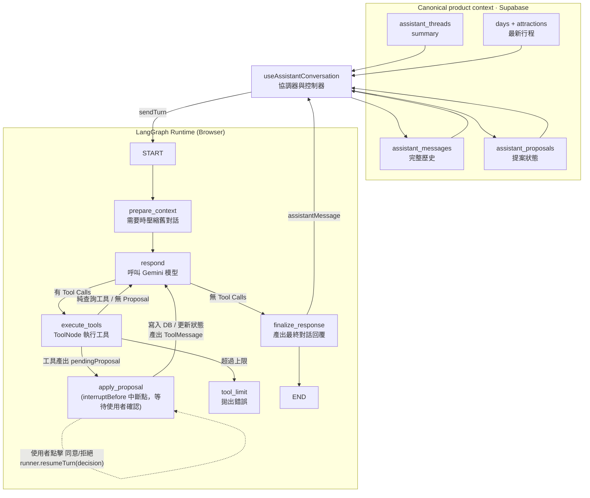
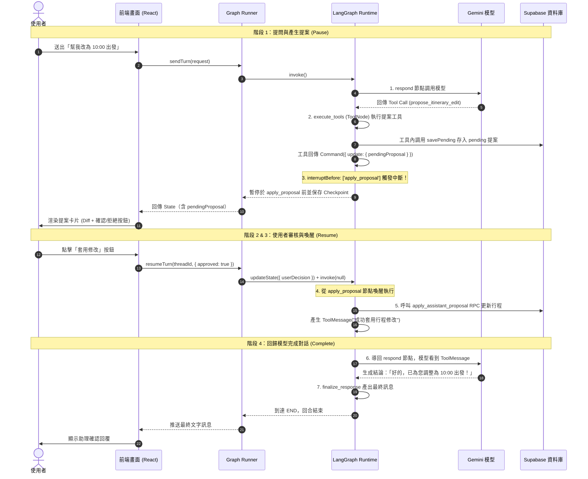

# 前端 LangGraph 維護指南

## 架構邊界

旅程助理的 LangGraph 完全在瀏覽器執行。主要程式分工如下：

- `src/features/assistant/graph/assistantGraph.ts`：graph、edge、checkpoint lifecycle、HITL 中斷與節點組裝。
- `src/features/assistant/graph/routing.ts`：依 model tool calls 與 state 狀態決定工具執行、提案審批中斷、回模型或完成回覆。
- `src/features/assistant/graph/nodes/prepareContextNode.ts`：前置摘要與近期對話整理。
- `src/features/assistant/graph/nodes/respondNode.ts`：每次只呼叫一次模型，產生 AI message 與 tool calls。
- `execute_tools`（直接使用 LangGraph `ToolNode`）：執行註冊的 LangChain 工具，若工具回傳 `Command` 產出 `pendingProposal` 則由 LangGraph 自動將 State 更新併入。
- `src/features/assistant/graph/nodes/applyProposalNode.ts`：HITL 中斷節點（`interruptBefore: ['apply_proposal']`）；當使用者於前端確認/拒絕後透過 `resumeTurn` 喚醒，執行套用或拒絕並產生 `ToolMessage` 回歸模型對話迴圈。
- `src/features/assistant/graph/nodes/finalizeResponseNode.ts`：把純文字模型回覆轉成最終 assistant message，並清空單回合工作記憶。
- `src/features/assistant/graph/nodes/toolLimitNode.ts`：超過工具呼叫迭代上限時拋出明確錯誤。
- `src/features/assistant/api/assistantApi.ts`：Gemini proxy adapter、單次 model invoke、prompt 組合與模型摘要。
- `src/features/assistant/api/assistantOperations.ts`：操作解析、Zod 驗證與 itinerary invariant 完整性檢查。
- `src/features/assistant/tools/index.ts`：LangChain tool registry（`assistantProposalTools` 與 `assistantGeneralTools`）。
- `src/features/assistant/tools/itinerary/`：行程修改提案工具（`proposeItineraryEditTool`）、Schema 定義、操作套用與地點 enrichment。
- `src/features/assistant/tools/todo/`：待辦清單提案工具（`proposeTodoListTool`）、Schema 定義與待辦套用。
- `src/features/assistant/AssistantSection.tsx`：組合 conversation controller、聊天室 view 與全頁 toolbar。
- `src/features/assistant/useAssistantConversation.ts`：thread/message/proposal 載入、canonical persistence、graph 執行與恢復、提案決策與 resumeTurn 協調。
- `src/features/assistant/components/AssistantConversationView.tsx`：對話列表、訊息、提案卡與 composer；不直接存取 repository 或 graph。
- `src/features/assistant/types.ts`：UI、repository 與 graph 共用的公開型別。
- `src/lib/assistantCheckpointer.ts`：以 Supabase Data API 實作 LangGraph `BaseCheckpointSaver`。
- `supabase/functions/gemini-proxy`：只代理已驗證使用者對固定 Gemini model 的 `generateContent`，不執行 graph，也不讀寫資料庫。
- `supabase/migrations/20260812130326_add_travel_assistant.sql`：聊天資料、checkpoint、RLS、checkpoint CAS 與 proposal 原子套用。

LangGraph state 是「可恢復的執行狀態」，不是產品資料的唯一來源。完整聊天歷史與 proposal 分別以 `assistant_messages`、`assistant_proposals` 為準；實際行程仍以 `days`、`attractions` 為準。不要只寫 checkpoint 而略過 canonical tables，也不要從 checkpoint 直接覆寫行程。

建立 runtime 的基本方式是：

```ts
const checkpointer = new SupabaseAssistantCheckpointer(supabase)
const runner = createAssistantGraph(checkpointer, {
  proposals: proposalPersistence,
})
```

Graph 注入的 `proposals` 包含：
- `savePending`：以 status `'pending'` 儲存提案卡。
- `applyPending`：呼叫 `apply_assistant_proposal(id, true)`，套用行程並補齊 Google 地點資料與 Todo。
- `rejectPending`：呼叫 `apply_assistant_proposal(id, false)`，將提案標記為拒絕。

---

## Context 如何運作

這裡的 context 指「模型在一個 turn 能看到的上下文」，不是 React Context。

Context 分成三層，不可互相取代：

| 層級 | 內容 | 來源與壽命 |
| --- | --- | --- |
| Canonical product context | 完整 messages、proposal 狀態、thread summary、最新 itinerary | Supabase tables/RPC；跨裝置的產品事實來源。 |
| Graph runtime context | `AssistantGraphState` 的 `summary`、近期 `messages`、本次 `request`、`pendingProposal`、`userDecision`、`modelMessages`、`toolRound` | LangGraph checkpoint；只為恢復執行，不保證含完整聊天歷史。 |
| Model prompt context | 舊摘要、近期對話、本次 user text、完整最新 itinerary、待辦與分類 | 每次 `respond` 即時組合；工具回傳 `ToolMessage` 後可再呼叫 Gemini。`dayRevisions` 留在 runtime control context，不送給模型。 |

資料流如下：



---

## Graph State 與流程

`AssistantGraphState` 位於 `src/features/assistant/types.ts`：

| 欄位 | 用途 |
| --- | --- |
| `graphVersion` | checkpoint 相容性版本；目前為 `ASSISTANT_GRAPH_VERSION = 5`。 |
| `summary` | 已壓縮的舊對話脈絡。 |
| `messages` | graph 目前保留的近期 user/assistant 訊息，不一定是完整聊天歷史。 |
| `request` | 當次尚待處理的 `AssistantTurnRequest`；完成後清為 `null`。 |
| `assistantMessage` | 最近一次模型產生的訊息，供 UI 即時顯示。 |
| `pendingProposal` | 目前等待使用者審批的提案物件；在中斷等待時持久化在 checkpoint 中。 |
| `userDecision` | 前端喚醒時傳入的使用者審批結果 `{ approved: boolean, feedback?: string }`。 |
| `modelMessages` | 本次模型回合的工作記憶（LangChain `BaseMessage[]`，包含 HumanMessage、AIMessage、ToolMessage）；完成後清空。 |
| `toolRound` | 已執行的工具回合數，用來限制外部工具無限循環（上限預設 4）。 |

### 節點與 Edge 拓撲

```text
START -> prepare_context -> respond
respond -> (tool calls > 0) -> execute_tools
respond -> (tool calls == 0) -> finalize_response -> END
execute_tools -> (state.pendingProposal != null) -> apply_proposal (paused by interruptBefore)
execute_tools -> (state.pendingProposal == null) -> respond
execute_tools -> (toolRound >= maxToolRounds) -> tool_limit
apply_proposal -> (resumed via resumeTurn) -> respond
```

### Node、Context 與 State 對照

| Node | 讀取的 Context | 產出與影響的 State | 外部副作用／下一步 |
| --- | --- | --- | --- |
| `prepare_context` | `request`、`summary`、`messages` | 更新 `summary` 與近期 `messages`，重置 `modelMessages` / `toolRound` | 必要時呼叫 `summarizeWithGemini`；固定前往 `respond` |
| `respond` | `summary`、`messages`、`request.text`、`request.itinerary`、待辦與 `modelMessages` | 呼叫 `invokeAssistantModel`，將 `AIMessage` 加入 `modelMessages` | conditional edge：有工具呼叫 $\to$ `execute_tools`；無工具呼叫 $\to$ `finalize_response` |
| `execute_tools` | `modelMessages` 的最後一個 AI message | 執行 `ToolNode`，若為提案工具則由 `Command` 更新 `pendingProposal`，並將提案存入 `proposals.savePending` | conditional edge：有 `pendingProposal` $\to$ `apply_proposal`；無則回到 `respond` |
| `apply_proposal` | `pendingProposal`、`userDecision` | 依決策套用/拒絕提案，重置 `pendingProposal: null`、`userDecision: null`，產生 `ToolMessage` | 透過 `proposals.applyPending` 或 `proposals.rejectPending` 寫入資料庫；固定回到 `respond` 讓模型產出結論 |
| `finalize_response` | 最後 `AIMessage` 文字內容、`request` | 建立最終 `AssistantMessage`，清空 `modelMessages: []`、重置 `request: null` | 固定前往 `END` |

---

## Human-in-the-Loop (HITL) 提案審批與迴圈延續

### 端到端完整生命週期（Tool Call $\to$ UI $\to$ 資料更新 $\to$ Graph 延續）

#### 階段 1：LLM 發動 Tool Call 到產生提案（Pause 中斷）

1. **模型決策 (`respond` 節點)**：
   * 使用者發送需求（如「幫我把第一天改成 10:00 出發」）。
   * `respondNode` 呼叫 Gemini，模型決定調用提案工具（`propose_itinerary_edit` 或 `propose_todo_list`）。
   * 路由函數 `routeAfterRespond` 偵測到有 Tool Calls，將執行導向 `execute_tools` 節點。

2. **工具執行與 Command 狀態更新 (`execute_tools` / `ToolNode`)**：
   * LangGraph 的 `ToolNode` 執行提案工具（如 `proposeItineraryEditTool`）。
   * 工具內部自行封裝：
     1. 驗證 operations（行程約束、時間格式、景點 ID 合法性等）。
     2. 組裝草案物件 `proposal: ItineraryChangeProposal`（狀態為 `'pending'`）。
     3. 呼叫 `savePending(proposal)` 將草案存入 Supabase 的 `assistant_proposals` 資料表（確保跨裝置與重新整理不遺失）。
     4. 產出 `assistantMessage`（包含 proposal 資料）。
     5. 回傳 `new Command({ update: { pendingProposal: proposal, assistantMessage } })`。
   * LangGraph `ToolNode` 將 `Command.update` 自動合併進 Graph State。

3. **HITL 中斷暫停 (`interruptBefore: ['apply_proposal']`)**：
   * 路由 `routeAfterTools` 檢查到 `state.pendingProposal != null`，決定下一個節點是 `apply_proposal`。
   * 因 Graph 配置了 `interruptBefore: ['apply_proposal']`，LangGraph 在進入 `apply_proposal` **前強制中斷暫停**，並將目前狀態保存至 Supabase Checkpoint。
   * 前端 `useAssistantConversation` 取得 State，React 在聊天室渲染 **提案卡片 UI（包含 Diff 比對與「套用修改」/「不套用」按鈕）**。

#### 階段 2：使用者在 UI 上做出審核選擇

1. 使用者在提案卡片上點擊 **「套用修改」（Approve）** 或 **「不套用」（Reject）**。
2. 前端 Hook `useAssistantConversation.ts` 觸發 `decideProposal`，呼叫：
   ```ts
   runner.resumeTurn(threadId, { approved: true })
   ```

#### 階段 3：喚醒 Graph 與更新資料（Resume Turn $\to$ 資料庫更新）

1. **注入決策與喚醒 (`runner.resumeTurn`)**：
   * `resumeTurn` 執行：
     ```ts
     await workflow.updateState(config, { userDecision: { approved } })
     await workflow.invoke(null, config)
     ```
   * 將使用者的決定注入 `state.userDecision`，並傳入 `null` 喚醒 LangGraph。

2. **資料庫套用 / 拒絕 (`apply_proposal` 節點)**：
   * Graph 從中斷點繼續執行 `apply_proposal` 節點：
     * **若 `approved === true`**：呼叫 `proposals.applyPending` $\to$ 呼叫 Supabase 原子 RPC `apply_assistant_proposal(proposal.id, true)` 更新行程資料庫（並非同步補齊 Google 地點資料），產出成功的 `ToolMessage`。
     * **若 `approved === false`**：呼叫 `proposals.rejectPending` $\to$ 將提案標記為 `rejected`，產出被拒絕的 `ToolMessage`。
   * 節點清除 `pendingProposal: null`、`userDecision: null`，並將 `ToolMessage` 放入對話工作記憶。

#### 階段 4：回歸模型迴圈產出自然結論（Complete 完成）

1. **回歸對話迴圈 (`apply_proposal` $\to$ `respond`)**：
   * `apply_proposal` 的 Edge 指向 `respond` 節點。
   * `respond` 再次呼叫 Gemini。此時 Context 包含了剛剛的 `ToolMessage`（記錄使用者已同意或拒絕）。
   * Gemini 根據執行結果產出自然的結尾確認（例如：「好的！已為您將第 1 天出發時間調整為 10:00，祝旅途順利！」）。

2. **完成回合 (`finalize_response` $\to$ `END`)**：
   * 因模型已產出純文字回覆（無更多 Tool Calls），路由導向 `finalize_response`。
   * 建立最終訊息、清空回合工作記憶，抵達 `END`。前端即時呈現這則確認訊息。

---

### 📊 完整時序圖



---

## 擴充方式

### 新增 Itinerary 操作

1. 在 `src/features/assistant/types.ts` 的 `AssistantOperation` 加入型別定義。
2. 在 `src/features/assistant/tools/itinerary/itineraryToolSchema.ts` 加入對應的 Zod Schema。
3. 在 `src/features/assistant/api/assistantOperations.ts` 的 `parseAssistantOperations` 與 `validateAssistantOperations` 補齊解析與驗證邏輯。
4. 在 `src/features/assistant/tools/itinerary/itineraryOperations.ts` 的 `applyItineraryOperations` 實作資料變更邏輯。
5. 更新 `src/features/assistant/tools/itinerary/ItineraryProposalView.tsx` 的 Diff 呈現。

### 新增 Todo 操作

1. 在 `src/features/assistant/tools/todo/todoToolSchema.ts` 定義 Zod Schema。
2. 在 `src/features/assistant/tools/todo/todoOperations.ts` 實作待辦套用邏輯。
3. 在 `src/features/assistant/tools/todo/TodoProposalView.tsx` 實作待辦清單 UI。

### 新增一般查詢工具（非 UI 提案類）

1. 使用 `@langchain/core/tools` 的 `tool(...)` 定義查詢工具（例如 `lookupWeatherTool`）。
2. 將工具加入 `src/features/assistant/tools/index.ts` 的 `assistantGeneralTools` 清單中。
3. 工具執行後回傳自然文字或物件，`ToolNode` 會自動包裝成 `ToolMessage` 並導回 `respond` 節點供模型進行進一步推理。

---

## 測試與驗證

主要測試檔案：
* `src/features/assistant/graph/assistantGraph.test.ts`：Graph 流程、路由、自動摘要、HITL 中斷與 `resumeTurn` 延續測試。
* `src/features/assistant/api/assistantOperations.test.ts`：操作解析、扁平/巢狀相容與 invariant 驗證。
* `src/features/assistant/tools/providerToolSchema.test.ts`：LangChain Tool Schema 宣告與 runtime 驗證。

執行指令：

```sh
npx vitest run src/features/assistant
npm run build
```
