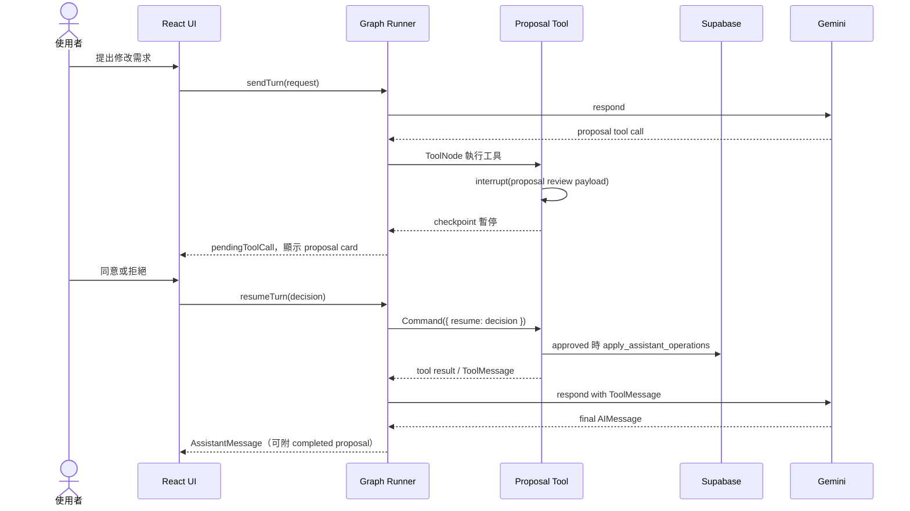

# 前端 LangGraph 維護指南

## 架構邊界

旅程助理的 LangGraph 完全在瀏覽器執行：

- `src/features/assistant/graph/assistantGraph.ts`：graph、edge、checkpoint lifecycle、dynamic interrupt 恢復與節點組裝。
- `src/features/assistant/graph/routing.ts`：依 model tool calls 與迭代上限決定工具執行、回模型或完成回覆。
- `src/features/assistant/graph/nodes/`：準備 context、呼叫模型、完成回覆與工具迭代上限。
- `execute_tools`：直接使用 LangGraph `ToolNode` 執行註冊工具。
- `src/features/assistant/tools/proposalToolRuntime.ts`：Todo 與 Itinerary 共用的 `interrupt()`、resume decision 與 ToolMessage payload 處理。
- `src/features/assistant/tools/itinerary/`：行程修改提案的 schema、操作驗證、套用與顯示。
- `src/features/assistant/tools/todo/`：待辦清單提案的 schema、操作套用與顯示。
- `src/features/assistant/useAssistantConversation.ts`：thread/message/proposal 載入、canonical persistence、graph 執行與 `resumeTurn` 協調。
- `src/lib/assistantCheckpointer.ts`：以 Supabase Data API 實作 LangGraph `BaseCheckpointSaver`。
- `supabase/functions/gemini-proxy`：代理已驗證使用者對固定 Gemini model 的 `generateContent`；不執行 graph，也不讀寫產品資料。

LangGraph checkpoint 是 pending tool call 與可恢復執行的唯一來源。暫停中的 proposal card 不會寫成 `AssistantMessage`，前端從 checkpoint task 的 interrupt payload 與原本的 AI tool call 推導 `pendingToolCall`；只有工具完成、LLM 產生最後文字後，才會建立 `AssistantMessage`。完成後的 proposal 可附在 `assistant_messages.metadata.proposal`，讓歷史仍能顯示已套用/已拒絕結果；新流程不再讀寫 `assistant_proposals`。實際行程仍以 `days`、`attractions` 與 `todo_items` 為準。

建立 runtime：

```ts
const checkpointer = new SupabaseAssistantCheckpointer(supabase)
const runner = createAssistantGraph(checkpointer, {
  proposals: proposalExecution,
})
```

`proposals.apply` 只在使用者同意後呼叫 `apply_assistant_operations(...)`。RPC 直接接收 preview snapshot、Todo 與 expected revisions，並以 user message 的 `threadId + turnId` metadata 作冪等 ledger。

## Context 與 Graph State

| 層級 | 內容 | 來源與壽命 |
| --- | --- | --- |
| Canonical product context | 完整 messages（含完成後 proposal card）、thread summary、最新 itinerary | Supabase tables/RPC；跨裝置的產品事實來源。 |
| Graph runtime context | `summary`、近期 `messages`、本次 `request`、`modelMessages`、`toolRound`，以及 checkpoint task 的 proposal interrupt | LangGraph checkpoint；只用來恢復執行。 |
| Model prompt context | 舊摘要、近期對話、本次 user text、最新 itinerary、待辦與分類 | 每次 `respond` 即時組合；工具完成後的 `ToolMessage` 也會送回模型。 |

`AssistantGraphState`：

| 欄位 | 用途 |
| --- | --- |
| `graphVersion` | checkpoint 相容性版本；目前為 `ASSISTANT_GRAPH_VERSION = 8`。 |
| `summary` | 已壓縮的舊對話脈絡。 |
| `messages` | graph 保留的近期 user/assistant 訊息。 |
| `request` | 當次 `AssistantTurnRequest`；完成後清為 `null`。 |
| `assistantMessage` | 最近一次真正完成的 assistant 訊息；pending interrupt 時保持 `null`。 |
| `pendingToolCall` | 從 checkpoint interrupt 與 AI tool call 推導的待確認工具呼叫，只是 UI view，不是 canonical message。 |
| `modelMessages` | 本回合的 LangChain 工作記憶，包含 HumanMessage、AIMessage、ToolMessage。 |
| `toolRound` | 已執行的工具回合數，上限預設為 4。 |

Graph 不再使用 `pendingProposal` 或 `userDecision` state，也沒有 `apply_proposal` node 或 `interruptBefore`。

## Graph 拓撲

```text
START -> prepare_context -> respond
respond -> (tool calls > 0) -> execute_tools
respond -> (tool calls == 0) -> finalize_response -> END
execute_tools -> (proposal tool calls interrupt()) -> paused inside tool
execute_tools -> (tool returns ToolMessage) -> respond
execute_tools -> (toolRound >= maxToolRounds) -> tool_limit
```

## Proposal HITL 流程

Todo 與 Itinerary proposal tools 只負責建立各自的 operations 與 proposal 文案，之後都呼叫共用的 `reviewProposal(proposal, runtime)`：

1. Proposal ID 直接沿用 `request.turnId`，不另外產生 UUID。
2. Tool 由 tool-call args 建立 operations、diff preview 與 Todo preview。
3. Tool 內呼叫 `interrupt({ type: 'proposal_review', toolCallId, proposal })`。Checkpoint 保存 tool task、interrupt payload 與原本的 AI tool call；runner 將它們轉成 `pendingToolCall`，UI 只 render card，不建立 assistant message。
4. 使用者同意或拒絕時，UI 一律呼叫 `runner.resumeTurn(threadId, decision)`。
5. Runner 以 `workflow.invoke(new Command({ resume: decision }), config)` 恢復原 tool task。
6. Tool 重新執行到同一個 `interrupt()`；同意時呼叫 `proposals.apply`，拒絕時不寫產品資料。
7. Tool 將精簡執行結果放在 `ToolMessage.content`、completed proposal 放在 `ToolMessage.artifact`，避免把完整 diff 傳給模型。
8. `ToolMessage` 回到 `respond` 交給 LLM 產生最後文字；`finalize_response` 最後才建立 `AssistantMessage`，並可把 completed proposal 附到 message metadata。



### Replay 注意事項

Dynamic interrupt 恢復時會從 tool 開頭重新執行，不是從 `interrupt()` 下一行繼續。因此：

- `interrupt()` 前只建立純資料 preview，不得寫入產品資料。
- Proposal ID 必須穩定，本專案直接使用既有的 `turnId`，不自行產生另一套 UUID。
- 真正的 itinerary/Todo 修改只能放在 `interrupt()` 後。
- Apply RPC 以 user message 的 `threadId + turnId` metadata 保持冪等，避免重複新增 Todo 或景點。
- Approve 與 reject 都必須恢復 graph，不可由 UI 跳過 checkpoint。

## 擴充方式

新增 proposal tool 時：

1. 定義與驗證 tool schema。
2. 從 `ToolRuntime.state.request` 建立 domain operations。
3. 使用 `request.turnId` 作為 proposal ID。
4. 呼叫共用 `reviewProposal`，不要另外建立 interrupt node 或 decision state。
5. 為 approve、reject、ToolMessage card、resume replay 與冪等 execution 加上測試。

一般查詢工具只需加入 `assistantGeneralTools`；正常回傳文字或物件後，`ToolNode` 會包裝成 `ToolMessage` 並回到 `respond`。

## 測試與驗證

- `src/features/assistant/graph/assistantGraph.test.ts`：Graph 流程、dynamic interrupt、approve/reject resume 與摘要。
- `src/features/assistant/api/assistantOperations.test.ts`：操作解析與 itinerary invariants。
- `src/features/assistant/tools/providerToolSchema.test.ts`：Tool schema 與 runtime context 驗證。

```sh
npm test -- --run
npm run build
```
